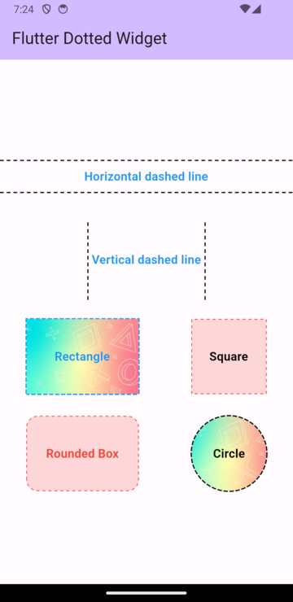

# dotted_separator

A Flutter package that provides a customizable Dotted separator and Dotted widgets.

## Screenshots



## Installation

Add the following dependency to your `pubspec.yaml` file:

```yaml
dependencies:
  dotter_separator: ^1.0.1
```

Then run `flutter pub get` to install the package.

## Usage

Import the package in your Dart code:

```dart
import 'package:dotter_separator/dotter_separator.dart';
```

Use the `DottedSeparator` widget to create a dotted line separator:

```dart
  DottedSeparator(
      height: 2,
      width: double.infinity,
      axis: Axis.horizontal,
      dashWidth: 5,
      dashSpace: 3,
      strokeWidth: 1.5,
      dashColor: Colors.black,
      padding: EdgeInsets.symmetric(vertical: 8),
    )     
```

In this example, the `DottedSeparator` widget is used to create a horizontal dotted line separator. You can customize its appearance by adjusting the `height`, `width`, `axis`, `dashWidth`, `dashSpace`, `strokeWidth`, `dashColor`, and `padding` properties.

## Parameters

- `height` (double): The height of the separator.
- `width` (double): The width of the separator.
- `axis` (Axis): The axis direction of the separator (horizontal or vertical).
- `dashWidth` (double): The width of each dash in the separator.
- `dashSpace` (double): The space between two consecutive dashes.
- `strokeWidth` (double): The thickness of each dash in the separator.
- `dashColor` (Color): The color of each dash in the separator.
- `padding` (EdgeInsetsGeometry): Optional padding for the separator.

```dart
  DottedContainer(
      height: 100,
      width: 100,
      linePosition: LinePosition.bottom,
      shape: Shape.line,
      color: Colors.black,
      borderRadius: BorderRadius.circular(10),
      dash: [4, 4],
      strokeWidth: 1,
      child: Center(
        child: Text(
          'Dotted Container',
          style: TextStyle(fontSize: 16),
        ),
      ),
    )
```

In this example, the `DottedContainer` widget is used to create a container with a dotted border. You can customize its appearance by adjusting the `height`, `width`, `linePosition`, `shape`, `color`, `borderRadius`, `dash`, `strokeWidth`, and `child` properties.

## Parameters

- `height` (double): The height of the container.
- `width` (double): The width of the container.
- `linePosition` (LinePosition): The position of the dotted line (top, bottom, left, right).
- `shape` (Shape): The shape of the container (rectangle or circle).
- `color` (Color): The color of the dotted line.
- `borderRadius` (BorderRadius): The border radius of the container.
- `dash` (List<int>): The pattern of dots and gaps in the dotted line.
- `strokeWidth` (double): The width of the dotted line.
- `child` (Widget): The child widget to be placed inside the container.
- `padding` (EdgeInsetsGeometry): Optional padding for the container's content.
- `margin` (EdgeInsetsGeometry): Optional margin for the container.


## Compatibility

This package supports both Android and iOS devices.

## Issues and Contributions

If you encounter any issues or would like to contribute to this package, please visit the [GitHub repository](https://github.com/kvkarthik96/dotted_border) for more information.

## License

This package is released under the [MIT License](https://opensource.org/licenses/MIT).
